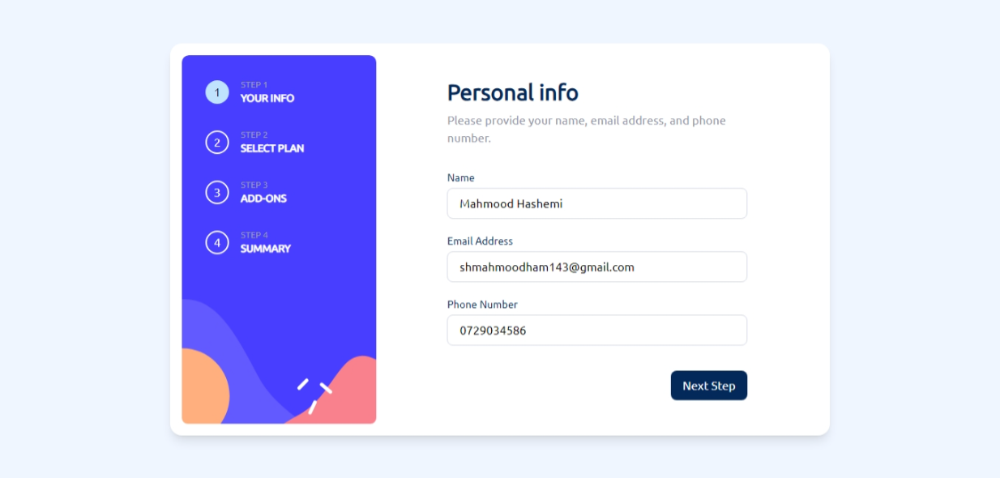

# Frontend Mentor Challenges - Part 2

This repository is a continuation of my [previous Frontend Mentor challenges repository](https://github.com/MahmoodHashem/Mentor-Challanges). As I complete more challenges, they will be documented here.

## Previous Work

> To see my earlier completed challenges (before  10 Dec, 2024), please visit:
> [Frontend Mentor Challenges - Part-1](https://github.com/MahmoodHashem/Mentor-Challanges)

## Current Challenges

Below are my latest Frontend Mentor challenge solutions:

### Repositories

  
  
Advance

    <ol>
    <li><a href="https://github.com/MahmoodHashem/Mentor-Challanges-2/tree/main/mutli-step-form">Multi Step Form</a></li>

</ol>

##### Multi Step Form

- [Live](https://multi-step-form-eta-smoky.vercel.app/) |[ Repo ](https://github.com/MahmoodHashem/Mentor-Challenges-2/tree/main/multi-step-form)| [Try out](https://www.frontendmentor.io/challenges/multistep-form-YVAnSdqQBJ)

  - 

## About Frontend Mentor

[Frontend Mentor](https://www.frontendmentor.io) provides real-world coding challenges to help developers improve their frontend coding skills with projects in HTML, CSS, and JavaScript.

## Contact

If you have any questions, feel free to [contact me](mailto:shmahmoodham143@gmail.com).

_Happy Coding!_
