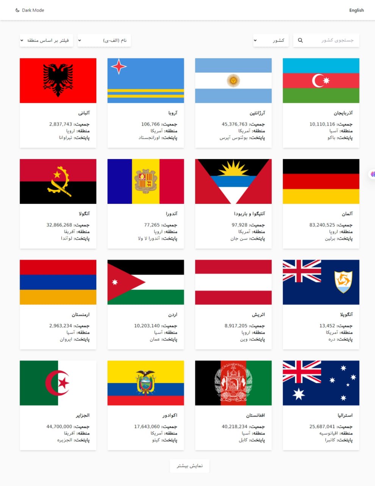
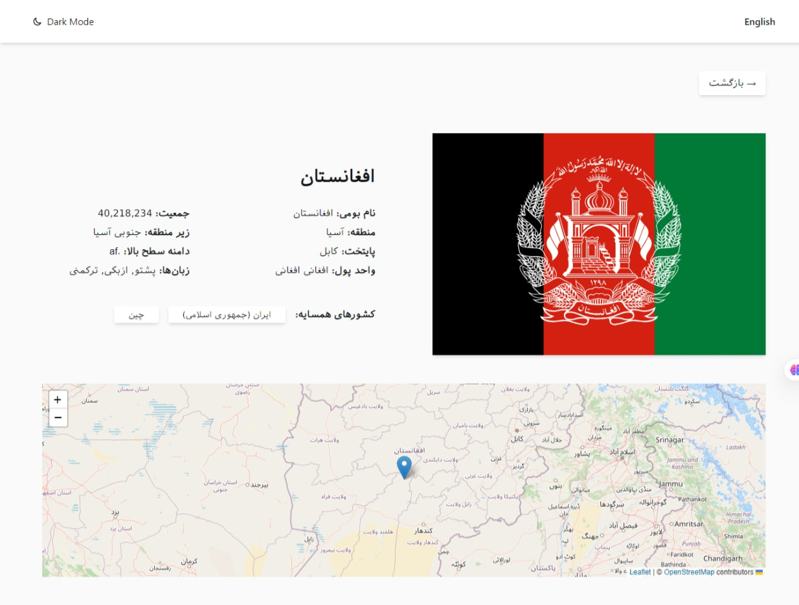

# Countries Explorer - A Clean Architecture React Application

## Overview

A modern React application showcasing countries information with advanced features and robust architecture. Built with clean code principles, maintainability, and scalability in mind.

## Technical Highlights

### Clean Architecture Implementation

* **Domain Layer** : Core business rules and interfaces
* **Application Layer** : Use cases implementation and business logic
* **Infrastructure Layer** : External concerns and data management
* **Presentation Layer** : React components and UI logic

### Key Features

* Advanced search with suggestions
* Dynamic filtering and sorting
* Keyboard navigation support
* Smooth transitions and animations
* Responsive design
* RTL/LTR language support
* Interactive map integration

### Technical Stack

* React
* TailwindCSS
* Framer Motion
* React Router
* Leaflet Maps

### Code Quality

* Modular component architecture
* Custom hooks for business logic
* Reusable shared components
* Clean and maintainable code structure
* Single Responsibility Principle
* Interface Segregation
* Dependency Inversion

### Project Structure

```bash
src/
├── domain/          # Core business rules
├── application/     # Use cases implementation
├── infrastructure/  # External interfaces
└── presentation/    # UI components
```


## Development Practices

* Component composition
* Custom hooks
* Clean code principles
* Responsive design
* Performance optimization
* Modern JavaScript features

## What Sets This Project Apart

* Strong architectural decisions
* Scalable and maintainable codebase
* Separation of concerns
* Business logic isolation
* Easy to test and modify
* Production-ready code quality

This project demonstrates professional React development skills with a focus on clean architecture, maintainability, and modern best practices.

## Screenshots




## Links

[Live Demo](https://world-countries-woad.vercel.app/) | [GitHub](https://github.com/MahmoodHashem/Mentor-Challenges-2/tree/main/countries)
