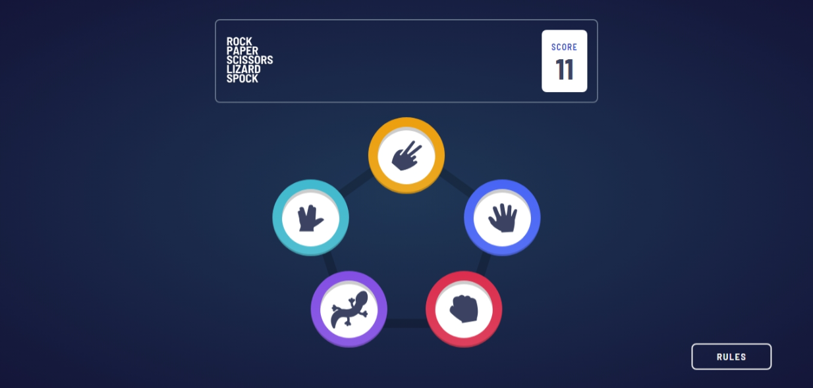

# Frontend Mentor - Rock, Paper, Scissors solution

This is a solution to the [Rock, Paper, Scissors challenge on Frontend Mentor](https://www.frontendmentor.io/challenges/rock-paper-scissors-game-pTgwgvgH). Frontend Mentor challenges help you improve your coding skills by building realistic projects.

## Table of contents

- [Overview](#overview)
  - [The challenge](#the-challenge)
  - [Screenshot](#screenshot)
  - [Links](#links)
- [My process](#my-process)
  - [Built with](#built-with)
  - [What I learned](#what-i-learned)
  - [Continued developmen](#continued-development)t
- [Author](#author)
- [Acknowledgments](#acknowledgments)

## Overview

### The challenge

Users should be able to:

- View the optimal layout for the game depending on their device's screen size
- Play Rock, Paper, Scissors against the computer
- Maintain the state of the score after refreshing the browser _(optional)_
- **Bonus**: Play Rock, Paper, Scissors, Lizard, Spock against the computer _(optional)_

### Screenshot

### Links

- [Solution URL](https://github.com/MahmoodHashem/Mentor-Challenges-2/tree/main/rock-paper-scissors)
- [Live Site URL](https://rock-paper-scissors-smoky-five.vercel.app/)

## My process

### Built with

- Semantic HTML5 markup
- Mobile-first workflow
- [React](https://reactjs.org/) - JS library
- [Tailwindcss](https://tailwindcss.com/) - React framework
- [Motion](https://motion.dev) - For Animations

### What I learned

- **Advanced React Patterns and Architecture:**

  - Custom hooks for centralized state management
  - Service layer for business logic separation
  - Layout component patterns for consistent UI structure
- **Modern Animation Techniques:**

  - Coordinated layout animations with LayoutGroup
- **State Management Best Practices:**

  - Efficient state updates with useCallback
  - Clean state reset patterns
  - Centralized game logic
- **Sound Implementation:**

  - Audio feedback system
  - Sound effect management
- **Component Design:**

  - Dynamic positioning systems
  - Flexible layout structures
- **Code Organization:**

  - Clear separation of concerns
  - Constants management
  - Service-based architecture
  - Maintainable file structure
- **Game Logic Implementation:**

  - Rule-based winning conditions

## Author

- [My Portfolio](https://main--mahmood-hashemi.netlify.app/)
- [Fronted Mentor](https://www.frontendmentor.io/profile/MahmoodHasheme/yourusername)
- [Twitter](https://twitter.com/Mahmood18999963)
- [LinkedIn](https://www.linkedin.com/in/shah-mahmood-hashemi-55172a276/)

## Acknowledgments

I would like to express my gratitude to all content creators, bloggers, and senior developers who have generously made learning web development accessible and free for us.
